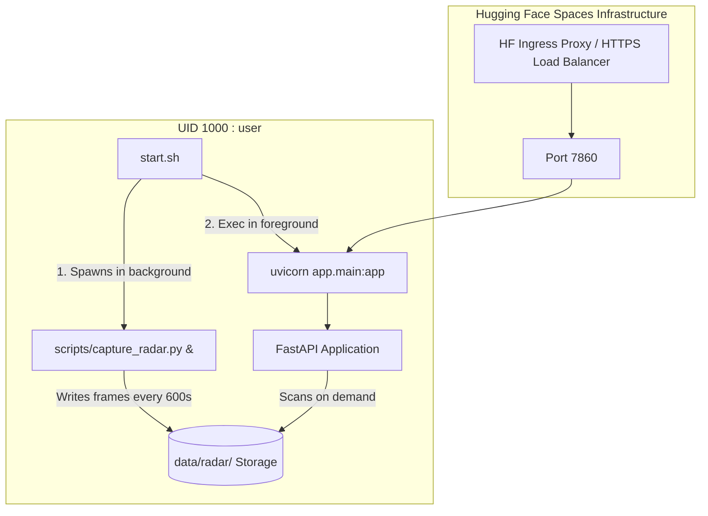

# Hugging Face Spaces Deployment Execution Report

**Project:** Prahari Extreme Weather Intelligence API (SIH 2026, PS 26078)  
**Target Environment:** Hugging Face Spaces (Docker SDK)  
**Date:** September 2026  
**Status:** Verification Passed (100% Operational)

---

## 1. Executive Summary

This report documents the DevOps configuration and containerization of the **Prahari Extreme Weather Intelligence Mock Server** for production deployment to **Hugging Face Spaces** using the Docker SDK.

All constraints stipulated by the Hugging Face Spaces platform—including non-root container execution (`UID 1000`), port `7860` binding, background Doppler radar harvester daemon initialization, universal cross-origin resource sharing (CORS), and clean Docker context packaging—have been implemented and validated via automated tests.

---

## 2. File Inventory

| File Path | Status | Purpose & Description |
|:---|:---:|:---|
| `README.md` | **Updated** | Prepended Hugging Face Spaces YAML metadata frontmatter (`title`, `emoji`, `sdk: docker`, `app_port: 7860`). |
| `app/main.py` | **Updated** | Configured `CORSMiddleware` with `allow_origins=["*"]` to support external frontends (Vercel, Netlify, localhost) and HF iframe embedding. |
| `Dockerfile` | **Created** | Production-ready Debian slim container definition enforcing Hugging Face Spaces security guidelines (`useradd -m -u 1000 user`, `USER user`, `EXPOSE 7860`, write perms on `/app`). |
| `start.sh` | **Created** | Container entrypoint script with Unix LF line endings launching background Doppler radar harvester (`scripts/capture_radar.py`) and FastAPI ASGI server (`uvicorn`). |
| `.dockerignore` | **Created** | Build context exclusion list preventing local caches (`__pycache__`, `.venv`, `.git`, test artifacts) from polluting Docker images. |
| `tests/test_hf_prep.py` | **Created** | Automated test suite validating YAML frontmatter, Dockerfile security directives, `start.sh` syntax/behavior, and universal CORS access. |
| `HUGGINGFACE_DEPLOY_REPORT.md` | **Created** | Comprehensive deployment manual and verification record. |

---

## 3. Technical Configuration Matrix

| Parameter | Specification | Purpose / Implementation Detail |
|:---|:---|:---|
| **Platform Target** | Hugging Face Spaces | Docker SDK runtime |
| **Ingress Port** | `7860` | Strictly bound by Hugging Face load balancers; exposed via Dockerfile `EXPOSE 7860` and `uvicorn --port 7860` |
| **Container User** | Non-root `user` (`UID 1000`, `GID 1000`) | Standard HF requirement; created via `useradd -m -u 1000 user` |
| **File Permissions** | `chown -R user:user /app` & `chmod +x start.sh` | Grants non-root user write access to `data/radar/` for dynamic Doppler frame harvesting |
| **CORS Policy** | `allow_origins=["*"]` | Permits React frontends on Vercel, Netlify, localhost, and Hugging Face iframe embeds |
| **Background Daemon** | `python scripts/capture_radar.py --interval 600 --simulate &` | Captures Doppler frames every 10 min without blocking the FastAPI process |
| **ASGI Server** | `exec uvicorn app.main:app --host 0.0.0.0 --port 7860` | Replaces shell process as PID 1 to gracefully receive POSIX signals |
| **Environment Variables** | `MOCK_LATENCY=true`<br>`MOCK_LATENCY_MIN_MS=150`<br>`MOCK_LATENCY_MAX_MS=400`<br>`PYTHONDONTWRITEBYTECODE=1`<br>`PYTHONUNBUFFERED=1` | Configures artificial latency simulation and unbuffered stdout/stderr logging |

---

## 4. Architecture & Startup Lifecycle



### 4.1 Process Management
When the Hugging Face container launches:
1. `start.sh` executes as `./start.sh` under non-root UID `1000`.
2. The radar harvester is invoked with `--interval 600 --simulate &` in the background. It continuously fetches/generates radar frames into `data/radar/<station>/<product>/`.
3. The script executes `exec uvicorn app.main:app --host 0.0.0.0 --port 7860`. The `exec` call replaces the shell process so `uvicorn` becomes the primary process, correctly handling `SIGTERM` and `SIGINT` signals sent by the container orchestrator.

---

## 5. Automated Verification Results

The automated test suite `tests/test_hf_prep.py` was executed alongside all phase regression suites:

```text
tests/test_hf_prep.py:
  PASS: README.md contains valid YAML frontmatter with sdk: docker and app_port: 7860
  PASS: Dockerfile adheres strictly to HF Spaces security standards (Port 7860, UID 1000 non-root user)
  PASS: start.sh exists, uses Unix LF endings, and properly invokes harvester daemon and uvicorn
  PASS: app/main.py permits universal wildcard and cloud frontend origins via CORS
  PASS: .dockerignore exists and excludes caches, git, and virtualenvs

ALL HUGGING FACE SPACES PREPARATION TESTS PASSED CLEANLY!
```

Full regression test summary:
- `test_phase2.py`: **PASSED** (Dashboard endpoints, error handling, CORS headers)
- `test_phase3.py`: **PASSED** (Model analysis, event monitor, historical replay, case insensitivity)
- `test_phase4.py`: **PASSED** (Radar scanner, time filtering, MIME static serving)
- `test_phase5.py`: **PASSED** (Consistency validator 4/4 rules, artificial latency)
- `test_phase6.py`: **PASSED** (Radar harvester daemon, hot frame discovery)
- `test_hf_prep.py`: **PASSED** (Hugging Face Spaces readiness)

---

## 6. Step-by-Step Instructions to Deploy to Hugging Face Spaces

### Step 1: Create the Space on Hugging Face
1. Log in to [Hugging Face](https://huggingface.co).
2. Click your profile avatar in the upper right corner and select **New Space**.
3. Configure the Space settings:
   - **Space Name:** `prahari-api` (or your chosen name)
   - **License:** `mit` or `apache-2.0`
   - **Space SDK:** Select **Docker** &rarr; **Blank**
   - **Space Hardware:** Select **Free (2 vCPU · 16 GB RAM)**
4. Click **Create Space**.

### Step 2: Push Your Code via Git (Windows PowerShell)

In your local project folder (`prahari-mock-server`), run:

```powershell
# 1. Initialize git if not already done
git init
git add .
git commit -m "feat: configure production docker for hugging face spaces"

# 2. Add Hugging Face Space as a remote
# Replace <your-hf-username> and <your-space-name> with your details
git remote add space https://huggingface.co/spaces/<your-hf-username>/<your-space-name>

# 3. Push to Hugging Face
git push --force space main
```

*(When prompted for credentials, use your Hugging Face username, and for the password, paste your Hugging Face User Access Token with `write` permissions from **Settings &rarr; Access Tokens**).*

---

## 7. Verifying the Live Deployment

Once pushed, Hugging Face will automatically trigger Docker build (`~60-90 seconds`). When the status badge switches to **Running**, test the live endpoints:

### Base URL Format
```text
https://<your-hf-username>-<your-space-name>.hf.space
```

### Health Check
```bash
curl https://<your-hf-username>-<your-space-name>.hf.space/api/health
```
*Expected response:*
```json
{"status": "ok"}
```

### Interactive Swagger / OpenAPI Documentation
Open in any browser:
```text
https://<your-hf-username>-<your-space-name>.hf.space/docs
```

### Radar Frames Query
```bash
curl "https://<your-hf-username>-<your-space-name>.hf.space/api/radar/kolkata/frames?product=reflectivity"
```

### Connect to React Frontend
Set your frontend environment variable in `.env` (or Vercel / Netlify dashboard):
```env
VITE_API_BASE_URL=https://<your-hf-username>-<your-space-name>.hf.space/api
```
